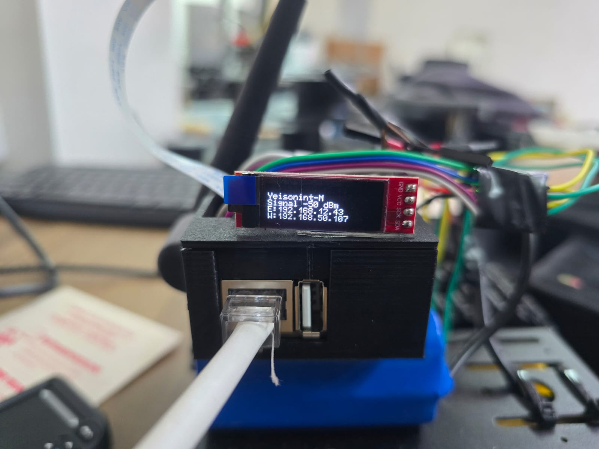
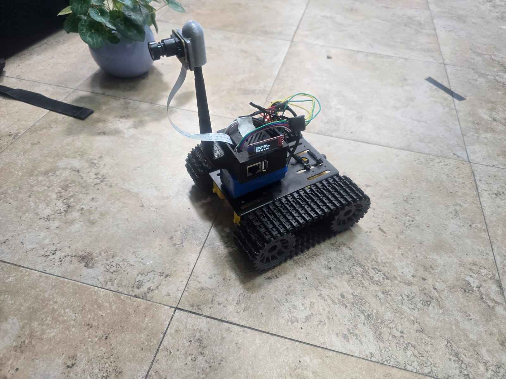

# Camera web strem with Luckfox Pico Ultra W

## Prerequisites
Based on [luckfox_pico_rkmpi_example]([https://](https://github.com/LuckfoxTECH/luckfox_pico_rkmpi_example)) repository.

Download [luckfox pico repository](https://github.com/LuckfoxTECH/luckfox-pico), build your board and export the path:

```bash
export LUCKFOX_SDK_PATH=/your/directory/luckfox-pico
cd $LUCKFOX_SDK_PATH
./build.sh lunch
```

Build python with http module in the [buildroot configuration](https://wiki.luckfox.com/Luckfox-Pico/Luckfox-Pico-RV1106/Luckfox-Pico-Ultra-W/Luckfox-Pico-SDK#7-buildroot-configuration).

```bash
./build.sh buildrootconfig
```

Flash the image

```bash
./build.sh 
sudo ./rkflash.sh update
```

## Build

```bash
mkdir build
cd build
cmake ..
make 
scp webstream root@172.32.0.93:/root
```

## Enable I2C and PWM channels

Open `luckfox-config` and enable [i2c](https://wiki.luckfox.com/Luckfox-Pico/Luckfox-Pico-RV1106/Luckfox-Pico-Ultra-W/Luckfox-Pico-I2C) for the display and some [PWM](https://wiki.luckfox.com/Luckfox-Pico/Luckfox-Pico-RV1106/Luckfox-Pico-Ultra-W/Luckfox-Pico-PWM/) channels, those channels must be the same as `websocket_server.hpp`.

## Test

* Configure [wifi](https://wiki.luckfox.com/Luckfox-Pico/Luckfox-Pico-Ultra-W-WIFI) on the Luckfox Pico Ultra W.

* Open 2 terminals and run `webstream` and the python http server (check client folder).




## Demostration

[🎥 See demo](res/control_test.mp4)